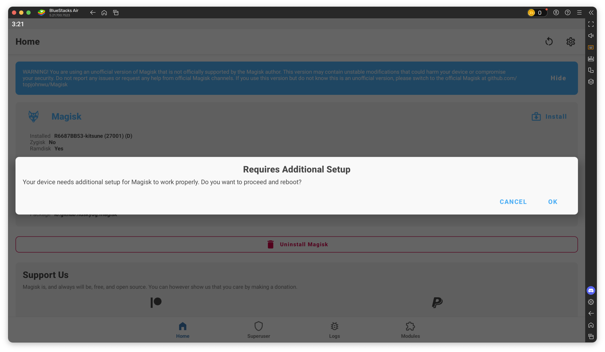

Root BlueStacks Air macOS
================

Tested on BlueStacks Air
- 5.21.680.7532
- 5.21.695.7506
- 5.21.700.7523
- 5.21.705.7515


## Requirements
- [BlueStacks Air](https://www.bluestacks.com/mac)
- [Kitsune Magisk](https://github.com/1q23lyc45/KitsuneMagisk/releases)  
  Tested version: v27.2-kitsune-4


## Rooting

- Install BlueStacks Air
- ‼️ **REQUIRED** ‼️ Open BlueStacks Air for the first time
- Close BlueStacks Air
- Download this repo and extract it
- Copy the downloaded Kitsune Mask apk to the project folder, and rename it to `magisk.apk`
- Open **Terminal.app** or **iTerm.app** and navigate to the project folder
  ```bash
  cd ~/Downloads/root-bluestacks-air
  ```


### Method 1: SIP enabled

- Execute `root.sh` with initrd output path and backup directory options
  ```bash
  bash root.sh -o files/initrd_hvf.img -b files/backup
  ```
  the above command will backup the original `initrd_hvf.img` in `files/backup` and create a patched one in `files/initrd_hvf.img`, you may specify a different paths for the output and backup directory
- Copy the patched `initrd_hvf.img` to the `/Applications/BlueStacks.app/Contents/img/` and replace the original `initrd_hvf.img`
- Start BlueStacks Air


### Method 2: SIP disabled

- Execute `root.sh` with sudo
  ```bash
  sudo bash root.sh
  ```
- Wait until BlueStacks Air starts


### Next Steps

- Install Kitsune Mask (`magisk.apk`)
- Open Kitsune Mask and press **OK** when the **Requires Additional Setup** prompt appears. This will reboot BlueStacks Air.
  
- Force quit BlueStacks Air if necessary
- Open BlueStacks Air and enjoy
- If you need **Zygisk**, enable it from Kitsune Mask settings and reboot BlueStacks Air


## Unrooting

### Method 1: SIP enabled

- Copy the backup `initrd_hvf.img` to `/Applications/BlueStacks.app/Contents/img/`
- Done

### Method 2: SIP disabled
- Make sure BlueStacks Air is closed
- Execute `unroot.sh` with sudo
  ```bash
  sudo bash unroot.sh
  ```
- Done


### Buy me a coffee
[](https://paypal.me/hanreev)
